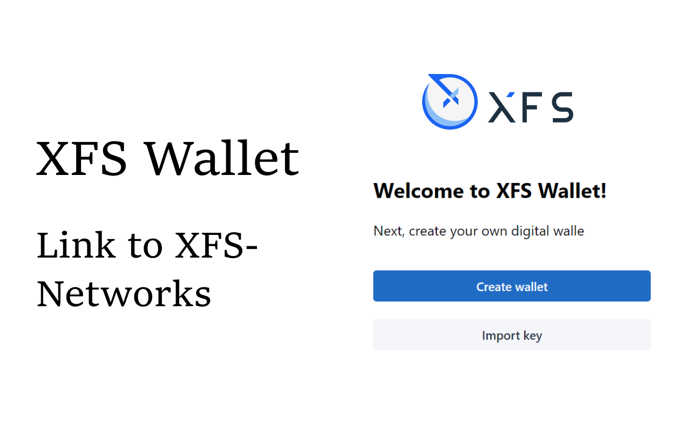

# XFSWALLET-CHROME


XFS Wallet is an extension for accessing XFS-Network enabled distributed applications, or "Dapps" in your normal Chrome browser!

The first and most popular XFS-Network wallet. Recommended by XFS-Network Foundation.



## Installation 

### From online

* [Chrome Web Store](https://chrome.google.com/webstore/detail/xfs-wallet/ndgniebdclhafddogjipaanimcjfffmi)

### From locally build

1. Download the dist.zip file from [repo releases page](https://github.com/xfs-network/xfswallet-chrome/releases)

2. Locate the ZIP file on your computer and unzip it.

3. Open chrome and navigate to extensions page using this URL: chrome://extensions.

4. Make sure "Developer mode" is enabled.

5. Click "Load unpacked extension" button, browse the unzipped folder and select it.

## Building From Source

After cloning the project, open the terminal and navigate to project root directory.

> XFSWallet-Chrome is built using `nodejs`, you must install the environment before starting 

```
npm i
npm run build
```

## Contribute

If you'd like to contribute to xfswallet-chrome please fork, fix, commit and
send a pull request. Commits who do not comply with the coding standards
are ignored. If you send pull requests make absolute sure that you
commit on the `develop` branch and that you do not merge to master.
Commits that are directly based on master are simply ignored.

## License

XFSWallet-Chrome is released under the open source MIT license and is offered “AS IS” without warranty of any kind, express or implied. Any security provided by the XFSWallet-Chrome software depends in part on how it is used, configured, and deployed. XFSWallet-Chrome is built upon many third-party libraries, xfs.tech makes no representation or guarantee that XFSWallet-Chrome or any third-party libraries will perform as intended or will be free of errors, bugs or faulty code. Both may fail in large or small ways that could completely or partially limit functionality or compromise computer systems. If you use or implement XFSWallet-Chrome, you do so at your own risk. In no event will xfs.tech be liable to any party for any damages whatsoever, even if it had been advised of the possibility of damage.